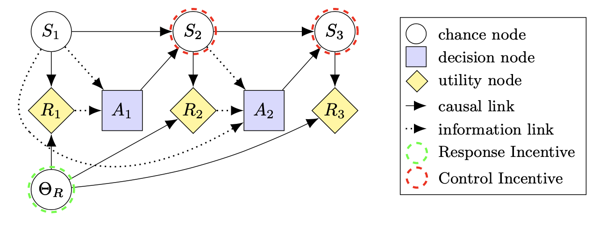

## About

This is Latex package for drawing (causal) influence diagrams (CIDs) and labeling incentives, maintained by the [Causal Incentives Working Group](https://causalincentives.com).

It can be used to draw diagrams such as this one:

## How to use

See the [tutorial](https://causalincentives.github.io/cid-latex-package/CausalInfluenceDiagramLatexTutorial.html).

## Updating this package
Before pushing an update to this package, please remember to:
1. Make sure that file [examples.tex](./examples.tex) compiles without error, and produces a PDF similar to [examples.pdf](./examples.pdf)
2. Update the version number with today's date. If it is the second update for the same day, add .2 to the date (e.g. 2021-01-11.2), and then .3 and so on.
